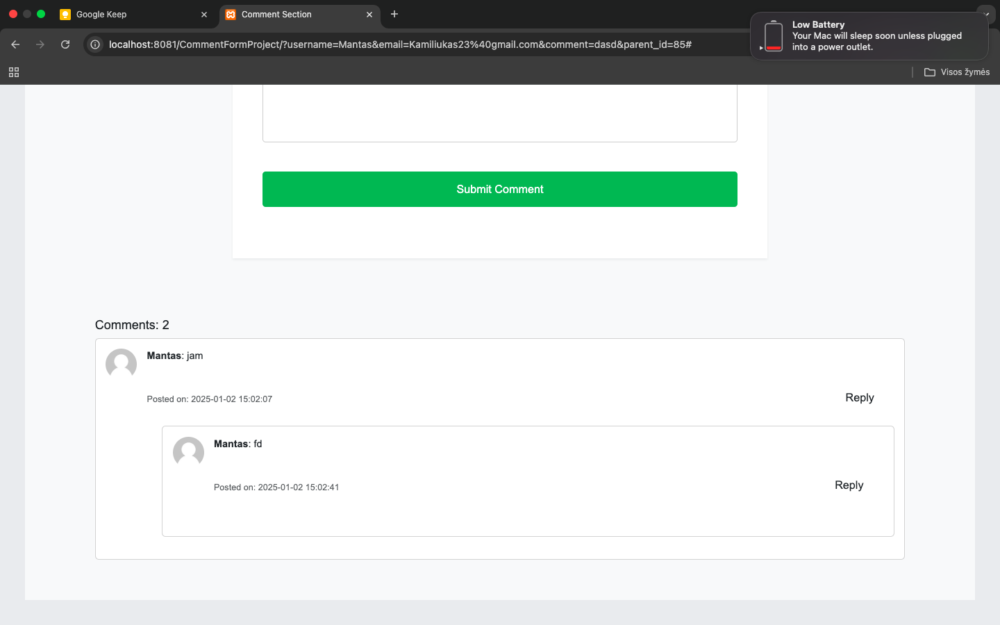

# CommentForm
Komentarų forma leidžia vartotojams palikti komentarus svetainėje

## Naudojimas
Ši FORMA sukurta naudojant Bootstrap. Ji naudoja Font Awesome ikonoms.

### Funkcijos

- Modernus išdėstymas su pasirinktais spalvomis/stiliais/fonais
- Atsakantis dizainas tiek mobile tiek dekstop
- naršymo meniu su stiliaus pakeitimais

#### Prielaidos

Prieš paleisdami programą, įsitikinkite, paleidziant su
- Mysql
